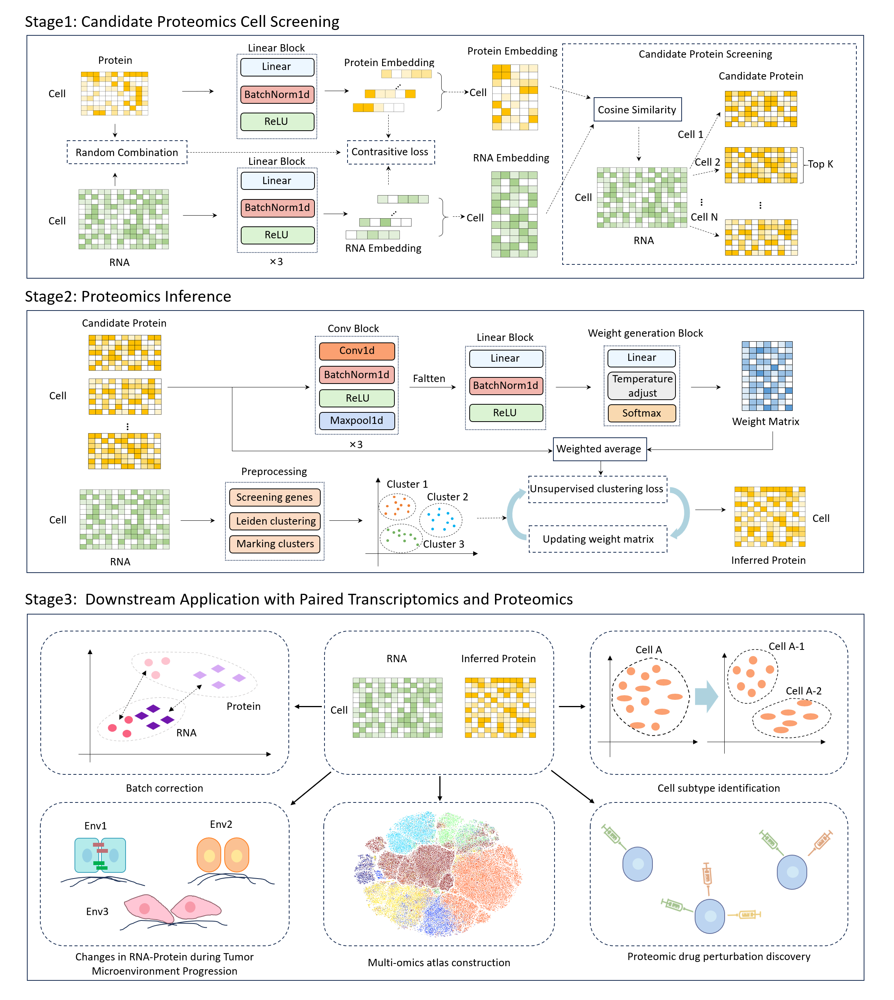

# msInfer


### Large-scale proteome inference from unpaired single-cell transcriptomic and proteomic data by msInfer

Comprehensive characterization of cellular states requires simultaneous measurements of transcriptomes and proteomes at single-cell resolution. However, current technologies either measure only limited protein panels or quantify thousands of proteins at extremely low throughput. As a result, obtaining large-scale paired transcriptomic–proteomic measurements at single-cell resolution remains challenging. Here we present msInfer, a computational framework that integrates unpaired scRNA-seq and single-cell mass spectrometry (scMS) proteomics data to enable large-scale proteome inference for individual transcriptomic cells. To address the weak correlation between mRNA and protein abundance, msInfer replaces traditional anchor-based integration with a cell type–guided contrastive learning strategy for cross-omics alignment and employs an unsupervised weight generation module to infer protein abundances. Across extensive computational benchmarking and experimental validation, msInfer shows strong concordance between inferred and experimentally measured protein expression. msInfer facilitates the exploration of drug-induced molecular changes, supports the construction of single-cell multi-omics atlas and improves cell subtype annotation. Overall, msInfer provides a scalable and robust framework for bridging transcriptomic and proteomic measurements and enables comprehensive multi-omics characterization of cellular states.

<p align="center">
  
</p>


## Environment

#### Option1 [recommend]
We provide more convenient online running examples that can be executed directly through Colab, without the need for local environment setup. Click the Colab icon to directly enter the online runtime environment to run the msInfer demo. 
<a href="https://colab.research.google.com/github/YuzhiSun/scInfer_colab/blob/main/Unpaired_benchmark_breast.ipynb" target="_parent"></a>

#### Option2
If you want to configure the environment locally, you can follow the configuration methods below.

The running environment of msInfer can be installed from enviornment.yml
```
> conda env create --name env_name -f environment.yml  
```

## Turorial

The following notebooks are provided to show how to run msInfer model

1. [BreastTaskEmbedding](BreastTaskEmbedding.ipynb) gives a detailed description of how to obtain embedding features for transcriptomics and proteomics.
2. [BreastTaskInfer](BreastTaskInfer.ipynb) gives a detailed description of how to infer proteomics data for transcriptomics.
3. [PancreasTaskEmbedding](PancreasTaskEmbedding.ipynb) gives a detailed description of how to generate embedding features for the target dataset by pre-training on gold standard data.
4. [PancreasTaskInfer](PancreasTaskInfer.ipynb) gives a detailed of how to infer proteomics data for target transcriptomics.

## Data

The data is stored on Zendo(https://doi.org/10.5281/zenodo.14986872); simply unzip the file named scInferData.zip into scInferData folder.

## Requirements

We can successfully run it on a single RTX 2080Ti GPU.

## Questions

If you have any suggestions/ideas for msInfer, please don't hesitate to reach out to us. You can reach us by email(yuzhi@stu.hit.edu.cn).


